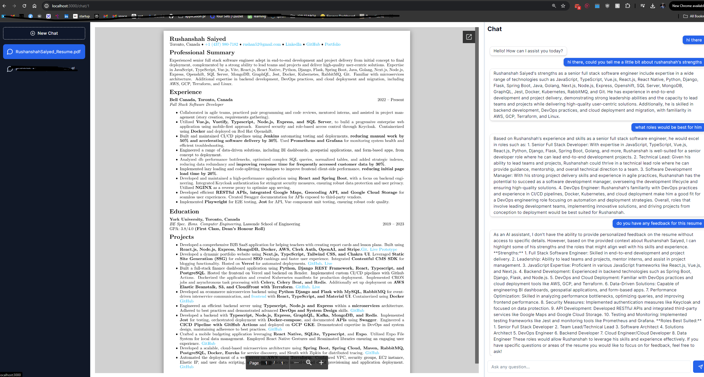

# ChatPDF-AI RAG - Chat with pdf documents using AI

## Introduction

ChatPDF-AI is a project that leverages the following technologies and libraries to enable users to chat with AI about a pdf document:

- Next.js: A framework for building server-side rendered React applications.
- Tailwind CSS: A utility-first CSS framework for rapidly building custom designs.
- Langchain: A library for building conversational AI applications, which relies on the following important libraries:
- OpenAI: A library for generating responses to user queries based on the context of the pdf document.
- Pinecone: A library for storing and retrieving the context of the pdf document.
- Drizzle ORM: A library for interacting with the Postgres database hosted on Vercel.

## Architecture

The project is built using the following technologies:

- Next.js: A framework for building server-side rendered React applications.
- Tailwind CSS: A utility-first CSS framework for rapidly building custom designs.
- Langchain: A library for building conversational AI applications.

The project consists of the following components:

- Frontend: The React frontend that allows users to upload a pdf document, chat with the document, and view the chat history.
- Backend: The server-side code that handles file uploads, chat requests, and chat responses.
- API: The server-side code that handles chat requests and chat responses.

## Features

The project provides the following features:

- File upload: Users can upload a pdf document and start chatting with the document.
- Chat: Users can ask questions about the pdf document and the AI assistant will generate responses based on the document's context.
- Chat history: Users can view the chat history and replay previous conversations.
- Responsive design: The project is built using responsive design principles to ensure a great user experience on different devices.

## Installation

To run the project locally, follow these steps:

1. Clone the project repository: `git clone https://github.com/your-username/chatpdf-ai.git`
2. Navigate to the project directory: `cd chatpdf-ai`
3. Install dependencies: `npm install`
4. Start the development server: `npm run dev`
5. Open your browser and navigate to `http://localhost:3000`

